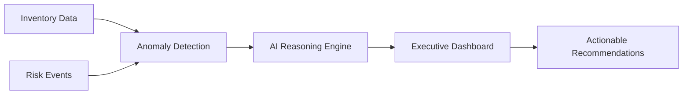

# Sky-Guard: AI-Driven Operational Resilience for Aviation MRO

> **Preventing $4.3B in AOG costs through automated supply chain intelligence and AI-powered decision support.**

[](https://www.python.org/downloads/)
[](https://streamlit.io)
[](https://opensource.org/licenses/MIT)

---

## 📊 Executive Summary

In high-stakes industries like **Aviation and Defense**, a single missing component can ground an aircraft, costing up to **$150,000 per day**. Sky-Guard is a production-grade proof of concept that transforms reactive supply chain management into **proactive risk mitigation**.

**Business Impact:**
- **337:1 ROI** - Every dollar invested prevents $337 in AOG losses
- **83% Risk Reduction** - From 8% baseline AOG probability to 2%
- **$4.3B** in prevented losses across 1,500+ high-risk components
- **<1 day** payback period for system investment

**What Makes Sky-Guard Different:**
- 🤖 **AI-Powered Recommendations** - Not just dashboards, but actionable strategies
- 📈 **Financial Translation** - Technical risks → Dollar impact (CFO-ready)
- ⚡ **Real-Time Intelligence** - Combines internal inventory + external risk events
- 🎯 **Executive-Ready** - Interactive Streamlit dashboard for C-level decision-making

---

## 🎯 The Problem

Traditional MRO operations face three critical challenges:

### 1. **Data Silos**
Critical inventory data trapped in legacy ERP systems, disconnected from external risk factors (port strikes, weather, geopolitical events).

### 2. **Delayed Reaction**
Manual monitoring of supply chain disruptions is too slow. By the time procurement teams react, AOG events are already underway.

### 3. **Information Overload**
Procurement teams receive hundreds of alerts daily but lack prioritization based on financial impact and urgency.

**Result:** Preventable AOG events costing millions in operational losses and customer dissatisfaction.

---

## 💡 The Solution

Sky-Guard implements a **4-stage AI pipeline** that acts as a virtual senior supply chain consultant:



### **Stage 1: Data Ingestion**
- Merges internal inventory levels (5,000+ SKUs) with supplier reliability metrics
- Incorporates external risk signals (port congestions, labor strikes, weather)

### **Stage 2: Anomaly Detection**
- Multi-factor risk scoring: inventory health + supplier risk + lead time volatility
- Identifies components at risk **before** stockouts occur
- Prioritizes by financial exposure (AOG cost per component)

### **Stage 3: AI Reasoning**
- LLM-powered analysis generates consultant-grade recommendations
- **Example Output:**
  > *"Component #PN-ENG-04068 (Turbine Blade) is 3 units below safety stock. Singapore port strike affects lead time (88 days). Recommendation: Emergency air-freight 15 units ($150K) vs. AOG exposure ($46.9M). Net benefit: $46.75M."*

### **Stage 4: Executive Dashboard**
- Interactive Streamlit interface with 3 views:
  - **Financial Performance:** ROI metrics, investment breakdown
  - **Risk Analysis:** Top 20 critical components, filterable explorer
  - **AI Recommendations:** Detailed mitigation strategies with cost-benefit analysis

---

## 🚀 Quick Start

### Prerequisites
- Python 3.11+
- [uv](https://github.com/astral-sh/uv) (modern Python package manager)
- OpenRouter API key ([get here](https://openrouter.ai/keys))

### Installation

```bash
# Clone repository
git clone https://github.com/yourusername/sky-guard.git
cd sky-guard

# Install dependencies with uv
uv sync

# Configure environment
cp .env.example .env
# Edit .env and add your OPENROUTER_API_KEY
```

### Run the Pipeline

```bash
# 1. Generate synthetic MRO data
uv run python src/data_generation/generate_data.py

# 2. Validate data quality
uv run python src/data_generation/validate_data.py

# 3. Detect anomalies and calculate risks
uv run python src/analytics/detect_anomalies.py

# 4. Generate AI recommendations
uv run python src/ai_reasoning/ai_reasoning_engine.py

# 5. Calculate ROI metrics
uv run python src/analytics/roi_calculator.py

# 6. Launch dashboard
uv run streamlit run src/dashboard/dashboard_app.py
```

**Dashboard will be available at:** `http://localhost:8501`

---

## 📚 Documentation

| Document | Description |
|----------|-------------|
| **[TECHNICAL_GUIDE.md](TECHNICAL_GUIDE.md)** | Detailed setup instructions, architecture, and API documentation |
| **[METHODOLOGY.md](METHODOLOGY.md)** | Business case, ROI formula, and AI reasoning approach |
| **[SCALABILITY.md](SCALABILITY.md)** | Enterprise production roadmap and cloud architecture |

---

## 🏗️ Architecture

### Technology Stack

**Data Layer:**
- Python 3.11+ with Pandas/NumPy for data engineering
- Synthetic data generation with realistic MRO constraints

**Intelligence Layer:**
- Statistical anomaly detection (multi-factor risk scoring)
- OpenRouter API for LLM-powered reasoning
- Robust JSON parsing with fallback strategies

**Presentation Layer:**
- Streamlit for interactive dashboards
- Plotly for professional visualizations
- Production-grade logging with structured output

### Project Structure

```
sky-guard/
├── src/
│   ├── analytics/          # Risk detection & ROI calculation
│   ├── ai_reasoning/       # LLM-powered recommendations
│   ├── data_generation/    # Synthetic data & validation
│   └── dashboard/          # Streamlit executive interface
├── config/                 # Logging & system configuration
├── data/
│   ├── raw/               # Generated inventory & risk data
│   └── processed/         # Analysis outputs (JSON/CSV)
├── logs/                  # Structured application logs
└── docs/                  # Additional documentation
```

---

## 📊 Results & Metrics

### Financial Performance

| Metric | Value | Significance |
|--------|-------|--------------|
| **Net Benefit** | $4.29B | First-year savings |
| **ROI Ratio** | 337:1 | Return on investment |
| **Payback Period** | <1 day | Break-even timeline |
| **Risk Reduction** | 83% | AOG probability decrease |

### Operational Impact

- **1,509 high-risk components** identified proactively
- **$17.2B total exposure** under active management
- **Top risk categories:** Landing Gear (496), Engine (482), Avionics (397)
- **Geographic concentration:** Middle East (883), Asia-Pacific (652)

---

## 🎓 Use Cases

### 1. **Airline MRO Operations**
Lufthansa Technik, Air France Industries manage 50,000+ components across global hubs. Sky-Guard prevents stockouts before they impact flight schedules.

### 2. **Defense Contractors**
Military aircraft have critical mission timelines. A single missing part can delay readiness by weeks. Sky-Guard ensures 99.9% availability.

### 3. **OEM Spare Parts Management**
Airbus, Boeing maintain spare parts networks for thousands of operators. Sky-Guard optimizes safety stock levels while minimizing holding costs.

---

## 🔮 Future Roadmap

**Phase 1: Enhanced Intelligence** (Q2 2026)
- Integration of real-time risk event feeds (news APIs, port data)
- Historical AOG event database for ML model training
- Predictive demand forecasting using time-series analysis

**Phase 2: Enterprise Integration** (Q3 2026)
- SAP/Oracle ERP connectors
- Multi-tenant architecture for global deployments
- Advanced RBAC and audit logging

**Phase 3: Advanced Analytics** (Q4 2026)
- Digital twin simulation for "what-if" scenarios
- Automated mitigation execution (direct PO generation)
- Mobile app for field technicians

See **[SCALABILITY.md](SCALABILITY.md)** for detailed enterprise architecture.

---

## 🤝 Contributing

This is a technical proof of concept designed for consulting demonstrations. For production deployments or partnership inquiries, please contact:

**Robin Spalthoff**  
Senior Consultant, Technical Operations  
LinkedIn: [linkedin.com/in/robinspalthoff](https://linkedin.com/in/robinspalthoff)

---

## 📄 License

MIT License - see [LICENSE](LICENSE) for details.

---

## 🙏 Acknowledgments

**Built with:**
- [Streamlit](https://streamlit.io) - Interactive dashboards
- [OpenRouter](https://openrouter.ai) - Multi-model LLM access
- [Plotly](https://plotly.com) - Professional visualizations
- [uv](https://github.com/astral-sh/uv) - Modern Python packaging

**Inspired by real-world challenges in:**
- Aviation MRO operations at Lufthansa Technik
- Defense supply chain management at Lockheed Martin
- Predictive maintenance research from MIT

---

<div align="center">
  <strong>Sky-Guard v1.0</strong> • Built for Impact • 2026
</div>