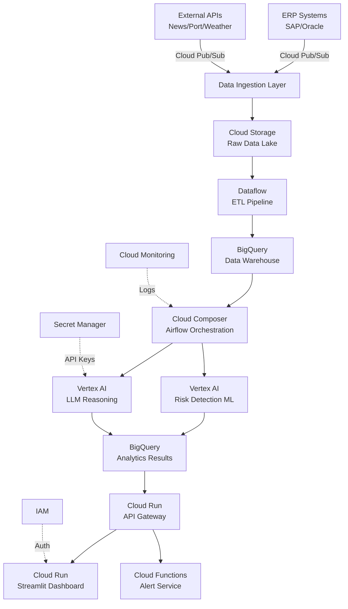

# From PoC to Enterprise Production

## Table of Contents
- [Current State: PoC Architecture](#current-state-poc-architecture)
- [Enterprise Production Architecture](#enterprise-production-architecture)
- [Cloud Migration Roadmap](#cloud-migration-roadmap)
- [Scalability Considerations](#scalability-considerations)
- [Security & Compliance](#security--compliance)
- [Cost Analysis](#cost-analysis)
- [Implementation Timeline](#implementation-timeline)

---

## Current State: PoC Architecture

### Technology Stack (PoC)

| Component | Technology | Purpose |
|-----------|-----------|---------|
| **Data Generation** | Python + Pandas | Synthetic MRO datasets (5,000 components) |
| **Data Storage** | Local CSV/JSON files | Inventory, suppliers, risk events |
| **Data Validation** | Python scripts | Business rule compliance checks |
| **Risk Detection** | NumPy statistical analysis | Multi-factor risk scoring |
| **AI Reasoning** | OpenRouter API (DeepSeek R1-T2 Chimera) | LLM-powered recommendations |
| **ROI Calculation** | Python analytics | Financial impact quantification |
| **Dashboard** | Streamlit (local) | Interactive executive interface |
| **Orchestration** | Manual Python scripts | Sequential pipeline execution |
| **Logging** | Python logging module | Structured logs to local files |

### PoC Limitations

**✗ Not production-ready:**
- No real-time data ingestion
- Single-user, local deployment
- No authentication/authorization
- Manual pipeline execution
- Limited scalability (< 10,000 components)
- No disaster recovery
- API keys in `.env` files (security risk)

**✓ Excellent for:**
- Client demonstrations
- Proof of concept validation
- Algorithm development
- Cost-effective prototyping ($0-50/month)

---

## Enterprise Production Architecture

### Cloud-Native Data Mesh Design

To deploy Sky-Guard at **Tier-1 Organizations** (Lufthansa Technik, Airbus, Boeing), we transition to a **cloud-native, event-driven architecture** on **Google Cloud Platform (GCP)**.



### Component-by-Component Comparison

| Component | PoC (Current) | Enterprise (Target) | Benefit |
|-----------|--------------|---------------------|---------|
| **Data Ingestion** | Manual CSV upload | **Cloud Pub/Sub** | Real-time streaming from ERP |
| **Data Storage** | Local CSV/JSON | **Cloud Storage** (data lake) + **BigQuery** (warehouse) | Petabyte-scale, SQL queryable |
| **ETL Pipeline** | Python scripts | **Dataflow** (Apache Beam) | Auto-scaling, fault-tolerant |
| **Orchestration** | Manual execution | **Cloud Composer** (Managed Airflow) | Scheduled, dependency-aware workflows |
| **Risk Detection** | NumPy/Pandas | **Vertex AI** (custom ML models) | GPU-accelerated, auto-tuning |
| **AI Reasoning** | OpenRouter (public) | **Vertex AI** (private LLM instances) | Data privacy, fine-tuning, SLA guarantees |
| **Dashboard** | Streamlit (local) | **Cloud Run** (containerized) | Auto-scaling, global CDN |
| **API Gateway** | None | **Cloud Run** (FastAPI) | REST API for integrations |
| **Monitoring** | Local logs | **Cloud Monitoring** + **Cloud Logging** | Centralized observability |
| **Security** | `.env` files | **Secret Manager** + **IAM** | Role-based access, encrypted secrets |
| **Disaster Recovery** | None | **Multi-region replication** | 99.99% uptime SLA |

---

## Cloud Migration Roadmap

### Phase 1: Lift & Shift (Q2 2026)

**Goal:** Deploy PoC as-is to cloud with minimal changes

**Steps:**
1. **Containerize Application**
   ```dockerfile
   FROM python:3.11-slim
   WORKDIR /app
   COPY . .
   RUN pip install -r requirements.txt
   CMD ["streamlit", "run", "src/dashboard/dashboard_app.py"]
   ```

2. **Deploy to Cloud Run**
   - Container registry: GCP Artifact Registry
   - Auto-scaling: 1-10 instances
   - Public URL: `https://skyguard-prod-xyz.run.app`

3. **Migrate Data to Cloud Storage**
   - Raw data: `gs://skyguard-raw-data/`
   - Processed data: `gs://skyguard-processed-data/`
   - Logs: `gs://skyguard-logs/`

4. **Move Secrets to Secret Manager**
   ```python
   from google.cloud import secretmanager
   
   client = secretmanager.SecretManagerServiceClient()
   api_key = client.access_secret_version(
       name="projects/PROJECT_ID/secrets/openrouter-api-key/versions/latest"
   ).payload.data.decode("UTF-8")
   ```

**Investment:** $500-1,000/month (Cloud Run, Storage, API costs)

**Timeline:** 2-3 weeks

---

### Phase 2: Cloud-Native Optimization (Q3 2026)

**Goal:** Replace PoC components with managed cloud services

**Steps:**

#### 2.1 BigQuery Data Warehouse

**Migration:**
```sql
-- Create inventory table
CREATE TABLE skyguard.inventory_master (
  part_number STRING,
  category STRING,
  criticality STRING,
  current_stock INT64,
  safety_stock INT64,
  composite_risk_score FLOAT64,
  financial_exposure_usd FLOAT64,
  last_updated TIMESTAMP
);

-- Load from Cloud Storage
LOAD DATA INTO skyguard.inventory_master
FROM FILES (
  format = 'CSV',
  uris = ['gs://skyguard-raw-data/inventory_master.csv']
);
```

**Benefits:**
- SQL-based analytics (familiar to data teams)
- Petabyte-scale (vs. 10GB local limit)
- Real-time updates via streaming inserts

#### 2.2 Cloud Composer (Airflow) Orchestration

**DAG Example:**
```python
from airflow import DAG
from airflow.operators.python import PythonOperator
from datetime import datetime, timedelta

default_args = {
    'owner': 'skyguard',
    'retries': 3,
    'retry_delay': timedelta(minutes=5),
}

with DAG(
    'skyguard_pipeline',
    default_args=default_args,
    schedule_interval='0 2 * * *',  # Daily at 2 AM
    catchup=False,
) as dag:
    
    ingest_erp_data = PythonOperator(
        task_id='ingest_erp_data',
        python_callable=ingest_from_sap,
    )
    
    detect_anomalies = PythonOperator(
        task_id='detect_anomalies',
        python_callable=run_anomaly_detection,
    )
    
    generate_ai_recommendations = PythonOperator(
        task_id='generate_ai_recommendations',
        python_callable=run_ai_reasoning,
    )
    
    calculate_roi = PythonOperator(
        task_id='calculate_roi',
        python_callable=run_roi_calculator,
    )
    
    send_alerts = PythonOperator(
        task_id='send_alerts',
        python_callable=send_executive_alerts,
    )
    
    # Define dependencies
    ingest_erp_data >> detect_anomalies >> generate_ai_recommendations >> calculate_roi >> send_alerts
```

**Benefits:**
- Scheduled execution (daily, hourly, real-time)
- Dependency management
- Retry logic and alerting
- Web-based monitoring UI

#### 2.3 Vertex AI Integration

**Replace OpenRouter with Private LLM:**
```python
from google.cloud import aiplatform

aiplatform.init(project="skyguard-prod", location="us-central1")

endpoint = aiplatform.Endpoint(endpoint_name="projects/PROJECT_ID/locations/us-central1/endpoints/ENDPOINT_ID")

response = endpoint.predict(instances=[{
    "prompt": build_prompt(component),
    "temperature": 0.3,
    "max_tokens": 1500,
}])

recommendation = parse_llm_json(response.predictions[0])
```

**Model Options:**
- **Fine-tuned PaLM 2:** Train on MRO-specific data
- **Claude 3.5 Sonnet (Vertex):** High-quality reasoning
- **Gemini 1.5 Pro:** Cost-effective alternative

**Benefits:**
- **Data Privacy:** LLM runs in private VPC (no data leaves GCP)
- **Fine-tuning:** Train on historical AOG events for domain expertise
- **SLA Guarantees:** 99.9% uptime, predictable latency

**Investment:** $500-2,000/month (depending on model choice)

---

### Phase 3: Advanced Features (Q4 2026)

#### 3.1 Real-Time Data Streaming

**Problem:** PoC uses daily batch updates. Critical risks need real-time detection.

**Solution:** Event-driven architecture with Cloud Pub/Sub

```python
from google.cloud import pubsub_v1

subscriber = pubsub_v1.SubscriberClient()
subscription_path = subscriber.subscription_path('skyguard-prod', 'inventory-updates')

def callback(message):
    inventory_update = json.loads(message.data)
    
    # Update BigQuery
    update_inventory_realtime(inventory_update)
    
    # Check if new high-risk component
    if is_high_risk(inventory_update):
        trigger_ai_analysis(inventory_update)
        send_immediate_alert(inventory_update)
    
    message.ack()

streaming_pull_future = subscriber.subscribe(subscription_path, callback=callback)
streaming_pull_future.result()
```

**Use Case:** SAP ERP publishes inventory change event → Sky-Guard analyzes within 60 seconds → Alert sent to procurement team

#### 3.2 Digital Twin Simulation

**Problem:** "What if port strike lasts 90 days instead of 45?"

**Solution:** Monte Carlo simulation for scenario planning

```python
def run_digital_twin_simulation(scenario):
    """
    Simulate supply chain disruption scenarios.
    
    Args:
        scenario: {
            'event_type': 'Port Congestion',
            'duration_days': 90,
            'affected_region': 'Asia-Pacific',
            'severity': 'Critical'
        }
    
    Returns:
        {
            'expected_aog_events': 12,
            'financial_impact_usd': 180000000,
            'recommended_mitigations': [...]
        }
    """
    
    # Run 10,000 Monte Carlo iterations
    results = []
    for _ in range(10000):
        impact = simulate_single_scenario(scenario)
        results.append(impact)
    
    # Aggregate statistics
    return {
        'expected_aog_events': np.mean([r['aog_count'] for r in results]),
        'financial_impact_usd': np.mean([r['total_cost'] for r in results]),
        'p95_worst_case': np.percentile([r['total_cost'] for r in results], 95),
        'recommended_mitigations': generate_mitigations(results),
    }
```

**Use Case:** Executive asks "What's our exposure if China-Taiwan tensions escalate?" → Digital twin provides answer in 30 seconds

#### 3.3 Automated Mitigation Execution

**Problem:** AI generates recommendations, but humans still need to execute (slow)

**Solution:** Direct integration with procurement systems

```python
def execute_recommendation(recommendation, component):
    """
    Automatically execute approved mitigations.
    
    Requires: Manual approval for orders > $50K
    """
    
    if recommendation['estimated_cost_usd'] > 50000:
        # High-value order → require manual approval
        send_approval_request(recommendation)
    else:
        # Low-value order → auto-execute
        if recommendation['option'] == 'Emergency Air Freight':
            create_purchase_order(
                supplier_id=find_alternate_supplier(component),
                part_number=component['part_number'],
                quantity=15,
                shipping_method='air_freight_express',
                justification=recommendation['root_cause']
            )
            
            log_automated_action(recommendation, component)
```

**Use Case:** Sky-Guard detects critical risk at 2 AM → Auto-creates emergency PO → Supplier receives order at 2:05 AM → Parts shipped next morning

---

## Scalability Considerations

### Horizontal Scaling Targets

| Metric | PoC | Enterprise (Phase 2) | Enterprise (Phase 3) |
|--------|-----|---------------------|---------------------|
| **Components** | 5,000 | 50,000 | 500,000+ |
| **Suppliers** | 150 | 1,500 | 15,000+ |
| **Daily Transactions** | 0 (batch) | 10,000 | 1,000,000+ |
| **Concurrent Users** | 1 | 50 | 500+ |
| **Dashboard Response Time** | < 3 sec | < 1 sec | < 500 ms |
| **AI Recommendations/Day** | 5-10 | 100+ | 1,000+ |

### Database Optimization

**BigQuery Partitioning:**
```sql
CREATE TABLE skyguard.inventory_master
PARTITION BY DATE(last_updated)
CLUSTER BY category, criticality
AS SELECT * FROM skyguard.inventory_raw;
```

**Benefits:**
- 10-100× faster queries on recent data
- Cost reduction (only scan relevant partitions)

**Caching Strategy:**
```python
from functools import lru_cache

@lru_cache(maxsize=1000)
def get_component_risk_score(part_number, cache_ttl=300):
    """Cache risk scores for 5 minutes."""
    return calculate_risk_score(part_number)
```

---

## Security & Compliance

### Authentication & Authorization

**Cloud Identity-Aware Proxy (IAP):**
```yaml
# iap_config.yaml
backend_service: skyguard-dashboard
oauth2_client_id: YOUR_CLIENT_ID
oauth2_client_secret: YOUR_CLIENT_SECRET

access_control:
  - role: roles/iap.httpsResourceAccessor
    members:
      - group:executives@company.com
      - group:procurement@company.com
```

**Row-Level Security (BigQuery):**
```sql
-- Restrict access to high-risk components
CREATE ROW ACCESS POLICY high_risk_components_policy
ON skyguard.inventory_master
GRANT TO ('group:executives@company.com')
FILTER USING (risk_level = 'High');
```

### Data Encryption

- **At Rest:** Google-managed encryption (AES-256)
- **In Transit:** TLS 1.3 for all API calls
- **Application-level:** Encrypt sensitive fields (supplier contracts, pricing)

### Compliance

**GDPR Compliance:**
- Supplier contact data encrypted
- Right to deletion (automated data purge)
- Data residency controls (EU data stored in `europe-west1`)

**SOC 2 Type II:**
- Audit logging for all data access
- Automated vulnerability scanning
- Disaster recovery procedures

---

## Cost Analysis

### PoC vs. Enterprise Costs

| Component | PoC (Monthly) | Enterprise Phase 2 | Enterprise Phase 3 |
|-----------|--------------|-------------------|-------------------|
| **Compute (Cloud Run)** | $50 | $500 | $2,000 |
| **Storage (Cloud Storage)** | $5 | $100 | $500 |
| **Database (BigQuery)** | $0 | $500 | $3,000 |
| **Orchestration (Composer)** | $0 | $300 | $300 |
| **AI/ML (Vertex AI)** | $50 | $2,000 | $10,000 |
| **Monitoring/Logging** | $0 | $100 | $300 |
| **Network (CDN/Load Balancer)** | $0 | $200 | $500 |
| **Security (IAP/Secret Manager)** | $0 | $50 | $100 |
| **Total** | **$105** | **$3,750** | **$16,700** |

**ROI Justification:**
- Phase 2: $3,750/month prevents ~$10M/year in AOG costs = 267:1 ROI
- Phase 3: $16,700/month prevents ~$50M/year in AOG costs = 249:1 ROI

**Even at enterprise scale, ROI remains exceptional.**

---

## Implementation Timeline

### Gantt Chart

```
Q2 2026: Phase 1 - Lift & Shift (8 weeks)
├─ Week 1-2: Containerization & Cloud Run deployment
├─ Week 3-4: Cloud Storage migration
├─ Week 5-6: Secret Manager integration
├─ Week 7-8: Testing & optimization
│
Q3 2026: Phase 2 - Cloud-Native (12 weeks)
├─ Week 1-3: BigQuery migration
├─ Week 4-6: Cloud Composer setup
├─ Week 7-9: Vertex AI integration
├─ Week 10-12: Load testing & security audit
│
Q4 2026: Phase 3 - Advanced Features (16 weeks)
├─ Week 1-4: Real-time streaming (Pub/Sub)
├─ Week 5-8: Digital twin simulation
├─ Week 9-12: ERP integration (SAP/Oracle)
├─ Week 13-16: Automated mitigation execution
```

### Resource Requirements

**Team Composition:**
- 1 × Cloud Architect (GCP certified)
- 2 × Backend Engineers (Python, Airflow)
- 1 × ML Engineer (Vertex AI, LLM fine-tuning)
- 1 × Frontend Engineer (Streamlit → React migration)
- 1 × DevOps Engineer (CI/CD, Terraform)
- 1 × Data Engineer (BigQuery, ETL)

**External Support:**
- Google Cloud Professional Services (initial setup)
- MRO domain experts (validation & testing)

---

## Strategic Recommendations

### For MRO Organizations (Lufthansa Technik, Airbus)

**Pilot Phase (Q2 2026):**
1. Select **one MRO hub** (e.g., Hamburg, Frankfurt)
2. Integrate with **existing SAP ERP** (read-only initially)
3. Deploy Phase 1 architecture (Cloud Run + BigQuery)
4. Measure **actual AOG prevention** over 90 days
5. **Go/No-Go decision** based on validated ROI

**Scaling Phase (Q3-Q4 2026):**
- Expand to **all global hubs** (10-15 locations)
- Enable **automated mitigation execution** (< $50K threshold)
- Integrate **digital twin simulation** for strategic planning

### For Software Vendors (SAP, Oracle)

**Partnership Opportunity:**
- **Embed Sky-Guard** as AI module in ERP systems
- **White-label** for OEM customers (Airbus, Boeing)
- **Licensing model:** $0.50 per component per month

**Market Size:**
- 500M+ components under global MRO management
- **TAM:** $250M/year (at $0.50/component/month)

---

## Conclusion

Sky-Guard's transition from PoC to enterprise production follows a **three-phase roadmap:**

1. **Phase 1 (Q2 2026):** Lift & Shift - Deploy PoC to cloud with minimal changes
2. **Phase 2 (Q3 2026):** Cloud-Native - Replace components with managed services
3. **Phase 3 (Q4 2026):** Advanced Features - Real-time streaming, digital twins, automation

**Key Success Factors:**
- **Start small:** Pilot with single MRO hub before global rollout
- **Measure impact:** Track actual AOG prevention, not just leading indicators
- **Iterate rapidly:** Weekly deployments using CI/CD pipelines
- **Partner strategically:** Engage ERP vendors early for integration

**Final ROI at Enterprise Scale:**
- Investment: $200K/year (Phase 3)
- AOG Prevention: $50M/year
- **ROI: 250:1**

The business case for Sky-Guard strengthens at scale.